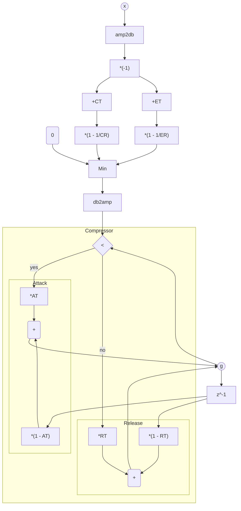

# TorchComp

Differentiable dynamic range controller in PyTorch.


## Compressor/Expander gain function

This function calculates the gain $g[n]$ for a compressor/expander. 
It takes the RMS of the input signal $x[n]$ and the compressor/expander parameters as input. 
The function returns the gain $g[n]$ in linear scale.
To use it as a regular compressor/expander, multiply the result $g[n]$ with the signal $x[n]$.

### Function signature

```python   
def compexp_gain(
    x_rms: torch.Tensor,
    comp_thresh: Union[torch.Tensor, float],
    comp_ratio: Union[torch.Tensor, float],
    exp_thresh: Union[torch.Tensor, float],
    exp_ratio: Union[torch.Tensor, float],
    at: Union[torch.Tensor, float],
    rt: Union[torch.Tensor, float],
) -> torch.Tensor:
    """Compressor-Expander gain function.

    Args:
        x_rms (torch.Tensor): Input signal RMS.
        comp_thresh (torch.Tensor): Compressor threshold in dB.
        comp_ratio (torch.Tensor): Compressor ratio.
        exp_thresh (torch.Tensor): Expander threshold in dB.
        exp_ratio (torch.Tensor): Expander ratio.
        at (torch.Tensor): Attack time.
        rt (torch.Tensor): Release time.

    Shape:
        - x_rms: :math:`(B, T)` where :math:`B` is the batch size and :math:`T` is the number of samples.
        - comp_thresh: :math:`(B,)` or a scalar.
        - comp_ratio: :math:`(B,)` or a scalar.
        - exp_thresh: :math:`(B,)` or a scalar.
        - exp_ratio: :math:`(B,)` or a scalar.
        - at: :math:`(B,)` or a scalar.
        - rt: :math:`(B,)` or a scalar.

    """
```

__Note__: 
`x_rms` should be non-negative.
You can calculate it using $\sqrt{x^2[n]}$ and smooth it with `avg`.


### Equations

$$
x_{\rm log}[n] = 20 \log_{10} x_{\rm rms}[n]
$$

$$
g_{\rm log}[n] = \min\left(0, \left(1 - \frac{1}{CR}\right)\left(CT - x_{\rm log}[n]\right), \left(1 - \frac{1}{ER}\right)\left(ET - x_{\rm log}[n]\right)\right)
$$

$$
g[n] = 10^{g_{\rm log}[n] / 20}
$$

$$
\hat{g}[n] = \begin{rcases} \begin{dcases}
    \alpha_{\rm at} g[n] + (1 - \alpha_{\rm at}) \hat{g}[n-1] & \text{if } g[n] < g[n-1] \\
    \alpha_{\rm rt} g[n] + (1 - \alpha_{\rm rt}) \hat{g}[n-1] & \text{otherwise}
\end{dcases}\end{rcases}
$$

### Block diagram

