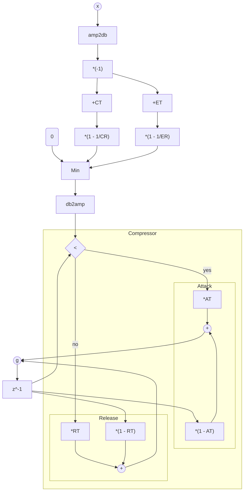
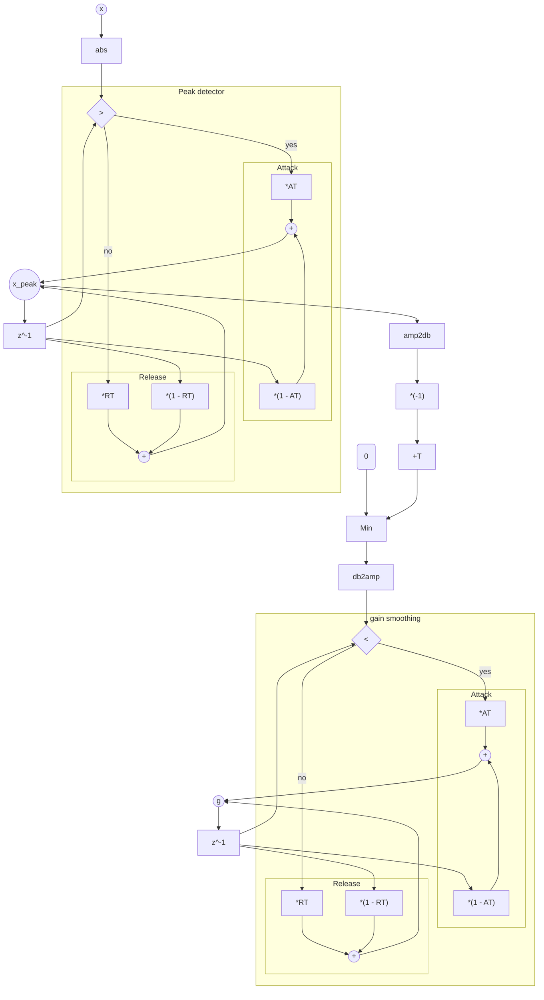

# TorchComp

Differentiable dynamic range controller in PyTorch.

## Installation

```bash
pip install torchcomp
```


## Compressor/Expander gain function

This function calculates the gain reduction $g[n]$ for a compressor/expander. 
It takes the RMS of the input signal $x[n]$ and the compressor/expander parameters as input. 
The function returns the gain $g[n]$ in linear scale.
To use it as a regular compressor/expander, multiply the result $g[n]$ with the signal $x[n]$.

### Function signature

```python   
def compexp_gain(
    x_rms: torch.Tensor,
    comp_thresh: Union[torch.Tensor, float],
    comp_ratio: Union[torch.Tensor, float],
    exp_thresh: Union[torch.Tensor, float],
    exp_ratio: Union[torch.Tensor, float],
    at: Union[torch.Tensor, float],
    rt: Union[torch.Tensor, float],
) -> torch.Tensor:
    """Compressor-Expander gain function.

    Args:
        x_rms (torch.Tensor): Input signal RMS.
        comp_thresh (torch.Tensor): Compressor threshold in dB.
        comp_ratio (torch.Tensor): Compressor ratio.
        exp_thresh (torch.Tensor): Expander threshold in dB.
        exp_ratio (torch.Tensor): Expander ratio.
        at (torch.Tensor): Attack time.
        rt (torch.Tensor): Release time.

    Shape:
        - x_rms: :math:`(B, T)` where :math:`B` is the batch size and :math:`T` is the number of samples.
        - comp_thresh: :math:`(B,)` or a scalar.
        - comp_ratio: :math:`(B,)` or a scalar.
        - exp_thresh: :math:`(B,)` or a scalar.
        - exp_ratio: :math:`(B,)` or a scalar.
        - at: :math:`(B,)` or a scalar.
        - rt: :math:`(B,)` or a scalar.

    """
```

__Note__: 
`x_rms` should be non-negative.
You can calculate it using $\sqrt{x^2[n]}$ and smooth it with `avg`.


### Equations

$$
x_{\rm log}[n] = 20 \log_{10} x_{\rm rms}[n]
$$

$$
g_{\rm log}[n] = \min\left(0, \left(1 - \frac{1}{CR}\right)\left(CT - x_{\rm log}[n]\right), \left(1 - \frac{1}{ER}\right)\left(ET - x_{\rm log}[n]\right)\right)
$$

$$
g[n] = 10^{g_{\rm log}[n] / 20}
$$

$$
\hat{g}[n] = \begin{rcases} \begin{dcases}
    \alpha_{\rm at} g[n] + (1 - \alpha_{\rm at}) \hat{g}[n-1] & \text{if } g[n] < \hat{g}[n-1] \\
    \alpha_{\rm rt} g[n] + (1 - \alpha_{\rm rt}) \hat{g}[n-1] & \text{otherwise}
\end{dcases}\end{rcases}
$$

### Block diagram



## Limiter gain function

This function calculates the gain reduction $g[n]$ for a limiter.
To use it as a regular limiter, multiply the result $g[n]$ with the input signal $x[n]$.

### Function signature

```python
def limiter_gain(
    x: torch.Tensor,
    threshold: torch.Tensor,
    at: torch.Tensor,
    rt: torch.Tensor,
) -> torch.Tensor:
    """Limiter gain function.
    This implementation use the same attack and release time for level detection and gain smoothing.

    Args:
        x (torch.Tensor): Input signal.
        threshold (torch.Tensor): Limiter threshold in dB.
        at (torch.Tensor): Attack time.
        rt (torch.Tensor): Release time.

    Shape:
        - x: :math:`(B, T)` where :math:`B` is the batch size and :math:`T` is the number of samples.
        - threshold: :math:`(B,)` or a scalar.
        - at: :math:`(B,)` or a scalar.
        - rt: :math:`(B,)` or a scalar.

    """
```

### Equations

$$
x_{\rm peak}[n] = \begin{rcases} \begin{dcases}
    \alpha_{\rm at} |x[n]| + (1 - \alpha_{\rm at}) x_{\rm peak}[n-1] & \text{if } |x[n]| > x_{\rm peak}[n-1] \\
    \alpha_{\rm rt} |x[n]| + (1 - \alpha_{\rm rt}) x_{\rm peak}[n-1] & \text{otherwise}
\end{dcases}\end{rcases}
$$

$$
g[n] = \min(1, \frac{10^\frac{T}{20}}{x_{\rm peak}[n]})
$$

$$
\hat{g}[n] = \begin{rcases} \begin{dcases}
    \alpha_{\rm at} g[n] + (1 - \alpha_{\rm at}) \hat{g}[n-1] & \text{if } g[n] < \hat{g}[n-1] \\
    \alpha_{\rm rt} g[n] + (1 - \alpha_{\rm rt}) \hat{g}[n-1] & \text{otherwise}
\end{dcases}\end{rcases}
$$


### Block diagram



## Average filter

### Function signature

```python
def avg(rms: torch.Tensor, avg_coef: Union[torch.Tensor, float]):
    """Compute the running average of a signal.

    Args:
        rms (torch.Tensor): Input signal.
        avg_coef (torch.Tensor): Coefficient for the average RMS.

    Shape:
        - rms: :math:`(B, T)` where :math:`B` is the batch size and :math:`T` is the number of samples.
        - avg_coef: :math:`(B,)` or a scalar.

    """
```

### Equations

```math
\hat{x}_{\rm rms}[n] = \alpha_{\rm avg} x_{\rm rms}[n] + (1 - \alpha_{\rm avg}) \hat{x}_{\rm rms}[n-1]
```

## TODO

- [x] CUDA acceleration in Numba
- [ ] PyTorch CPP extension
- [ ] Native CUDA extension
- [x] Forward mode autograd
- [ ] Examples

## Citation

If you find this repository useful in your research, please cite our work with the following BibTex entry:

```bibtex
@misc{ycy2024diffapf,
    title={Differentiable All-pole Filters for Time-varying Audio Systems},
    author={Chin-Yun Yu and Christopher Mitcheltree and Alistair Carson and Stefan Bilbao and Joshua D. Reiss and György Fazekas},
    year={2024},
    eprint={2404.07970},
    archivePrefix={arXiv},
    primaryClass={eess.AS}
}
```
